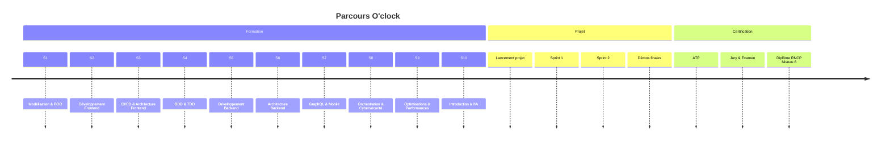

<h1 align="center">
  
</h1>

  
  
  
  

  
  
  
  

---

## 🚀 À propos de moi

Développeur passionné **diplômé Concepteur Développeur d'Applications** chez O'clock, avec une expérience pratique réussie chez **Web and Co 2.0**. Spécialisé dans le développement d'applications métier complexes, de l'analyse de données financières aux ERPs pour entreprises.

**🔭 Projets récents :**
- 📊 **Extraction de données financières** (Java/Angular/IA)
- 🏗️ **ERP entreprise de maçonnerie** (Java/Angular)
- 🌟 **[SkillSwap](https://skillswap.koyeb.app/)** - Plateforme d'échange de compétences

**🎓 Formation :** RNCP niveau 6 - O'clock (Jan 2024 - Juil 2025)  
**💼 Expérience :** Alternance Web and Co 2.0 (Mars-Août 2024)  
**🌱 Spécialisations :** Backend, GraphQL, IA, Cybersécurité  
**📍 Localisation :** Région Centre-Val de Loire  

---

## 💼 Expérience Professionnelle

### 🏢 **Web and Co 2.0** - Concepteur Développeur d'Applications
**Janvier 2024 - Août 2025 | Alternance**

<table>
  <tr>
    <td width="50%">
      <h4>📊 Extracteur de Données Financières</h4>
      <ul>
        <li>🤖 Intégration API Anthropic pour analyse PDF</li>
        <li>⚙️ Système de traitement par lots optimisé</li>
        <li>🔄 API robuste pour l'analyse documentaire</li>
      </ul>
    </td>
    <td width="50%">
      <h4>🏗️ ERP Entreprise de Maçonnerie</h4>
      <ul>
        <li>🏗️ Gestion complète chantiers/clients/facturation</li>
        <li>🔄 Refactorisation services de traitement</li>
        <li>📅 Automatisation par schedulers</li>
      </ul>
    </td>
  </tr>
  <tr>
    <td colspan="2">
      <h4>🏠 API Agence Immobilière</h4>
      <ul>
        <li>🔄 Intégration plateforme immobilière / WordPress via API Apimo</li>
        <li>🔔 Système complet de gestion d'alertes client personnalisables</li>
        <li>📧 Notifications email/SMS automatiques</li>
      </ul>
    </td>
  </tr>
</table>

> 🔒 *Projets confidentiels clients - Non disponibles publiquement*

---

## 🛠️ Stack Technique

<b>🖥️ Backend</b>

 

<b>🎨 Frontend</b>

 

<b>🗄️ Bases de Données & APIs</b>

 

<b>🚀 DevOps & Outils</b>

 

---

## 🎯 Projets Phares

<table>
  <tr>
    <td width="50%">
      <h3>🌟 SkillSwap</h3>
      
<strong>Plateforme d'échange de compétences</strong>

      
<code>Nest.js • Next.js • PostgreSQL • Docker</code>

      <ul>
        <li>🤝 Mise en relation par compétences</li>
        <li>🐳 Application dockerisée</li>
        <li>🔄 API REST avec authentification</li>
      </ul>
      

        
      

    </td>
    <td width="50%">
      <h3>💼 Projets Professionnels</h3>
      
<strong>Réalisés en alternance</strong>

      
<code>Java Spring Boot • Angular • PostgreSQL</code>

      <ul>
        <li>📊 Extracteur données financières (IA)</li>
        <li>🏗️ ERP Maçonnerie complet</li>
        <li>🏠 API Immobilière + alertes</li>
      </ul>
      

        
      

    </td>
  </tr>
</table>

---

## 📊 Statistiques GitHub

  
  

  

  

  

---

## 🎓 Parcours de Formation O'clock

**Progression actuelle :** 🤖 **Saison 10 - Introduction à l'IA** ✨

<strong>🗓️ Curriculum complet (Jan 2024 - Juil 2025)</strong>

**✅ Modules maîtrisés :**
- 🏗️ Modélisation & POO
- 🎨 Développement Frontend
- 🚀 CI/CD & Architecture
- 🧪 BDD & TDD
- ⚙️ Développement Backend
- 🏛️ Architecture Backend
- 📱 GraphQL & Mobile
- 🔒 Orchestration & Cybersécurité
- ⚡ Optimisations & Performances

**🔄 En cours :**
- 🤖 Introduction à l'IA
- 📝 Projet final en équipe
- 🎓 Accompagnement vers l'emploi

---

## 🏆 Compétences & Expertise

### 🎯 Domaines de spécialisation

<table>
  <tr>
    <td width="33%">
      <h4>🔧 Développement d'APIs</h4>
      <ul>
        <li>REST & GraphQL</li>
        <li>Intégrations tierces</li>
        <li>Authentification JWT</li>
        <li>Documentation Swagger</li>
      </ul>
    </td>
    <td width="33%">
      <h4>🏗️ Applications Métier</h4>
      <ul>
        <li>ERPs & CRMs</li>
        <li>Systèmes de gestion</li>
        <li>Automation processus</li>
        <li>Business Intelligence</li>
      </ul>
    </td>
    <td width="33%">
      <h4>🤖 Intelligence Artificielle</h4>
      <ul>
        <li>Intégration APIs IA</li>
        <li>Analyse de documents</li>
        <li>Traitement automatisé</li>
        <li>Machine Learning basics</li>
      </ul>
    </td>
  </tr>
</table>

### 📈 Métriques de qualité

---

## 🌍 Langues & Soft Skills

  <table>
    <tr>
      <td align="center">
        <h4>🇫🇷 Français</h4>
        
Natif

      </td>
      <td align="center">
        <h4>🇬🇧 Anglais</h4>
        
TOEIC: 630/990

      </td>
    </tr>
  </table>

**🧩 Soft Skills :**  

**🎯 Centres d'intérêt :** Randonnée 🥾 • Karting 🏎️ • Astronomie 🔭 • Tech 💻

---

## 📫 Me contacter

  <h3>🚀 Ouvert aux opportunités CDI en développement full-stack ! 🚀</h3>
  
<em>📍 Région Centre-Val de Loire • 🎓 Diplômé juillet 2025</em>

  
   
  
  
  
  
  

---

## 💭 Inspiration du moment

  

---

  <h3>⭐ Merci pour votre visite ! N'hésitez pas à explorer mes repositories ⭐</h3>
  
  

